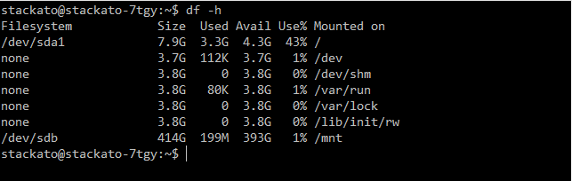
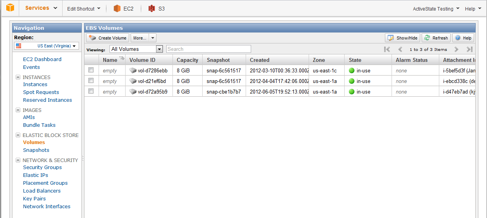
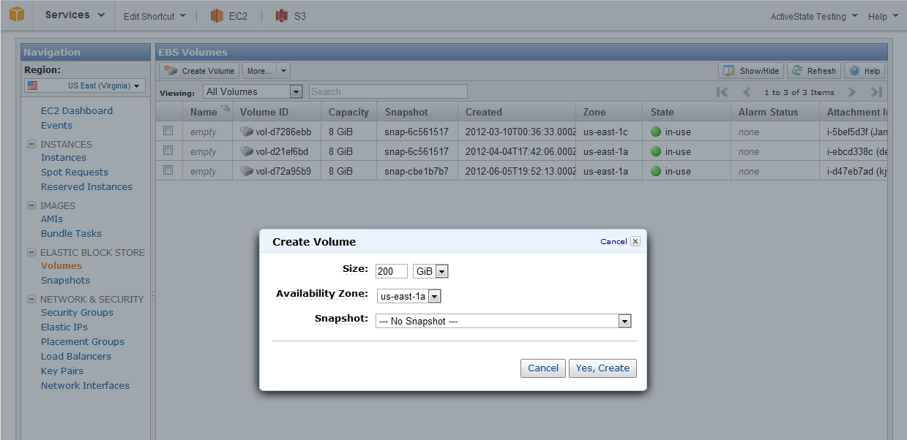
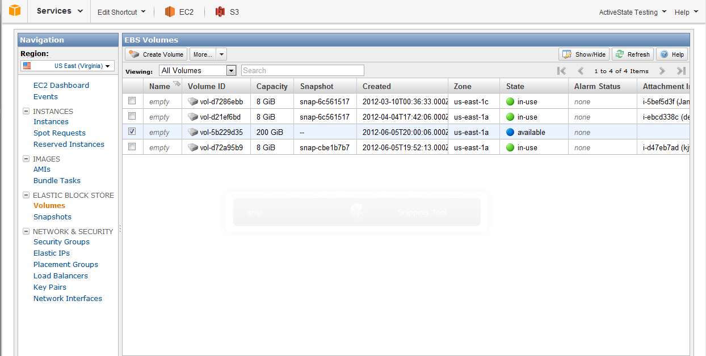
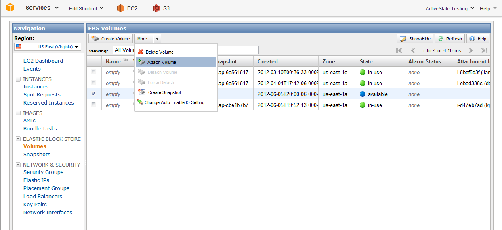
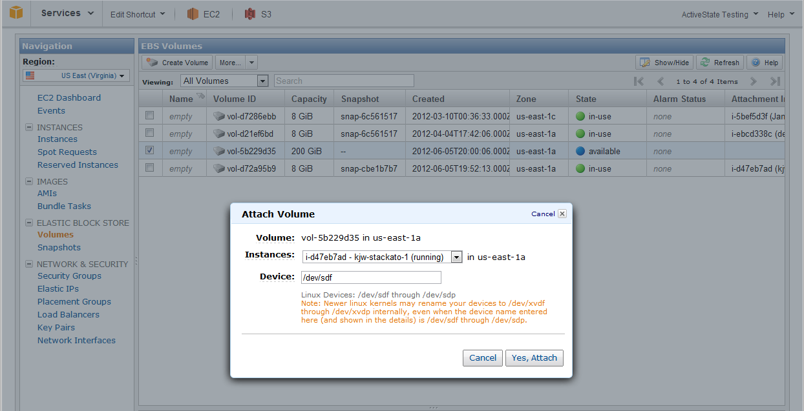
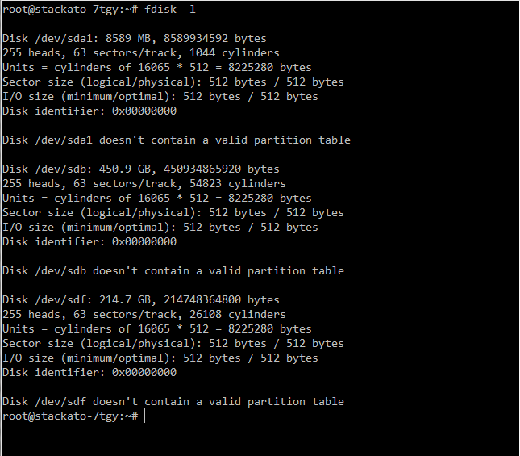
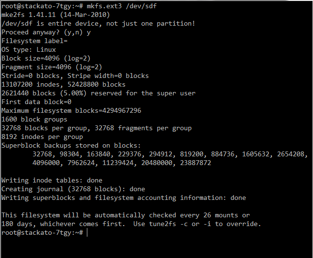

.. _vm-ec2:

.. index:: EC2
.. index:: EC2 AMI
.. index:: AMI

Amazon EC2
==========

Amazon supplies a prebuilt Stackato :term:`AMI` on its :term:`EC2` platform.

.. _server-vm-ec2:

Initial Setup
-------------

#. `Request access to the Stackato AMI <http://www.activestate.com/stackato/amazon_ami/>`_.

   You will need to provide your AWS Account ID (12-digit number) and will
   receive a confirmation email from ActiveState when the AMI have been
   successfully provisioned into your AWS Account.
   
#. Choose the latest Stackato VM available under "My AMIs -> Shared with me"

#. Choose a **m3.medium or larger** (3.7GB+ RAM) instance.

#. Add at least 30GB of storage to the instance (SSD or Magnetic).

#. Tag the instance with a **Name** (optional). 

#. Configure/select an appropriate Security Group. See the
   :ref:`Security Groups <server-vm-ec2-firewall>` section for
   details. 

#. After launching the image, associate an `Elastic IP
   <http://aws.amazon.com/articles/1346>`_ with it.
   Elastic IP allocates a static external address for your cluster and
   exposes this address on the border router where the cluster is
   hosted.  The router associates this address with a corresponding dynamic
   address local to your cluster.  This address is leased over :term:`DHCP`,
   along with the address of the local DNS server, which in turn keeps
   track of private addresses allocated by the DHCP server.  Thus each
   node in your cluster automatically knows the private address of the head
   node, while outside traffic knows the public address.

   Publish this external address for your chosen domain name via either
   :ref:`DNS <server-config-dns>` or :ref:`dynamic DNS <server-config-dyndns>`.
   For example, a static DNS zone file for "stackato-test" in "example.com"
   would have these entries:

   .. parsed-literal::
			
	stackato-test     IN  A       *AWS-Elastic-IP*.
	\*.stackato-test   IN  CNAME   stackato-test

   (Note the "." ending the A record.)

   See the :ref:`DNS <server-config-dns>` section for other guidance on DNS configuration.

#. Once the Stackato server is launched,
   login via ``ssh`` as user ``stackato`` with password ``stackato``::

	$ ssh stackato@stackato-test.example.com

   Do *not* change the password in this step - it will happen in the console setup.
   
   In this example, ``stackato-test.ddns.us`` will be the fully
   qualified domain name (FQDN) resolved by dynamic DNS at domain ``ddns.us``::
        
	$ kato node rename stackato-test.ddns.us
   

At this point you can complete the configuration of the
Stackato :term:`micro cloud` via the :ref:`Management Console
<management-console>`. Direct your browser to the hostname you've
configured above, and step through the Welcome pages to create the first
admin user.  The password you use here will become the stackato system
user password for subsequent logins via ``ssh``.

To setup a multi-node, clustered Stackato :term:`PaaS`, follow the steps
outlined in the :ref:`Cluster Setup <cluster-setup>` documentation.

.. _server-vm-ec2-firewall:

.. index:: EC2 Security Groups

Security Group Settings
-----------------------

Create a new "Stackato" AWS `Security Group
<http://docs.amazonwebservices.com/AWSEC2/latest/UserGuide/using-network-security.html>`_
or modify an existing one to fulfils the requirements listed here. The
Security Group settings will vary depending on whether Stackato is
configured as a stand-alone micro cloud, or a full cluster.

Security groups can be managed from either the `AWS Console
<http://aws.amazon.com/console/>`_ or `EC2 commands
<http://docs.amazonwebservices.com/AWSEC2/latest/CommandLineReference/>`_
such as ``ec2-create-group`` and ``ec2-authorize``.

Single AWS Instance
^^^^^^^^^^^^^^^^^^^

For a single micro cloud Stackato instance, only the following TCP ports
are required:

.. cssclass:: fields table-striped table-bordered table-condensed

========  ========  ===========================
Port      Service   Source
========  ========  ===========================
22        ssh       0.0.0.0/0 (or specific IP)
80        http      0.0.0.0/0
443       https     0.0.0.0/0
========  ========  ===========================

This will allow administrative access via SSH and general user access
via HTTP and HTTPS. In a micro cloud configuration, all Stackato
components communicate with one another via localhost (127.0.0.1), so
additional port access should not be required.

AWS Cluster
^^^^^^^^^^^

With a Stackato cluster, you must allow TCP access on all ports (0 -
65535) between the nodes of the cluster. To do this, add a rule with the
Type "All TCP" and specify the "Stackato" Security Group (or your own
existing one) as the Source by specifying its Security Group ID.

Select "Custom IP" in the Source drop-down list, and start typing the
name of your security group in the adjacent field. Select the group from
the list of matches to insert the ID (e.g. "sg-5a6ff830" below).

.. cssclass:: fields table-striped table-bordered table-condensed

========  ============  ============  ======================
Type      Protocol      Port Range    Source
========  ============  ============  ======================
SSH       TCP           22            Anywhere   0.0.0.0/0
HTTP      TCP           80            Anywhere   0.0.0.0/0
HTTPS     TCP           443           Anywhere   0.0.0.0/0
All TCP   TCP           0-65535       Custom IP  sg-5a6ff830
========  ============  ============  ======================

This configuration exposes ssh, HTTP, and HTTPS access to all nodes in
the cluster, which you may not want. Lock down access to non-gateway
nodes by creating a second "Stackato-Internal" Security Group which
exposes all TCP ports *only* to the Stackato and Stackato-Internal
groups. This allows access on all TCP ports, but only for the Stackato
and Stackato-Internal groups. The internal group needs only two rules
for this, allowing "All TCP" between both groups:

.. cssclass:: fields table-striped table-bordered table-condensed

========  ============  ============  ======================
Type      Protocol      Port Range    Source
========  ============  ============  ======================
All TCP   TCP           0-65535       Custom IP  sg-5a6ff830
All TCP   TCP           0-65535       Custom IP  sg-9a6dfaf0
========  ============  ============  ======================

All DEA and Data Service nodes should use the Stackato-Internal group,
while externally exposed nodes (e.g. Router) use the "Stackato" group.

Once you've created the Stackato Internal group, add its ID to the
original Stackato group in a new "All TCP" rule to ensure that VMs in
both security groups can communicate with one another.

.. note::

	See :ref:`Stackato port requirements <cluster-config-ports>`
	for more information on how these ports are used.

.. include:: ../common/harbor-ports.inc

.. _server-vm-ec2-etc-hosts:

Verify /etc/hosts
-----------------

See :ref:`Modifying /etc/hosts <server-config-etc-hosts>`.
  
.. _server-vm-ec2-nagios:

System Monitoring with Nagios
-----------------------------

If Nagios is installed on your EC2 instances, you can use it to monitor and report resource utilization.
See the :ref:`Best Practices Guide <bestpractices-nagios>` for details.

.. _server-vm-ec2-elb:

EC2 Elastic Load Balancer
-------------------------

Stackato clusters can be set up behind an `EC2 Elastic Load Balancer
<http://aws.amazon.com/elasticloadbalancing/>`__ to spread web traffic
between :ref:`two or more Stackato Router nodes
<cluster-load-balancer>`.

The load balancer will need to be part of a security group which allows
access on ports 80 (HTTP) and 443 (HTTPS). If there are no other
gateways into the Stackato cluster, allow access to an arbitrary
external port (between 1024 and 4999) which can be forwarded to
port 22 internally for administrative access via SSH.

Setting up :ref:`key-based, passwordless authentication
<bestpractices-passwordless-ssh>` on the router nodes is recommended
when exposing SSH.

The load balancer's **Port Configuration** settings should be set up as
follows:

.. cssclass:: fields table-striped table-bordered table-condensed

======================  ==================  =================  =============
Load Balancer Protocol  Load Balancer Port  Instance Protocol  Instance Port
======================  ==================  =================  =============
TCP                     80                  TCP                80
SSL                     443                 SSL                443
TCP                     2222 (example)      TCP                22
======================  ==================  =================  =============

With this configuration the load balancer will pass SSL connections
through to the router nodes. See the :ref:`Using your own SSL
certificate <server-config-ssl-cert-own-use>` and :ref:`CA Certificate
Chaining <server-config-ssl-cert-chain>` sections for instructions on
setting up certificates on the router nodes. 

.. _server-vm-fs-relocate-ec2:

Persistent storage for /var/vcap
--------------------------------

The default set of disks in an EC2 instance is rather limited.
Root volumes are of limited size, and the disk mounted on ``/mnt`` is ephemeral.
The size of the ephemeral disk varies by the instance type.
Stackato stores its services data on the root filesystem.

It's therefore prudent to check EC2 instances for disk utilization.
In the following example, run on a fresh medium Stackato instance,
we can see that the root filesystem is already almost half full::

	$ df -h

You can create a more robust instance by moving the Stackato service
data and droplets onto an Amazon EBS (Elastic Block Store) volume.
Assuming that you have signed up for EBS, the procedure is as follows:

Create the EBS Volume
^^^^^^^^^^^^^^^^^^^^^

In the EC2 console, click on the **Volumes** entry under the *Elastic Block Store* section.

Click the **Create Volume** button and enter the size you wish your EBS volume to have.
Make sure you set the *Availability Zone* to match the zone your instance is running in.

Your volume is now ready to attach and will be marked as "Available".

Under the *More* menu at the top of the screen, choose **Attach Volume**.

Select your instance from the drop-down list.
Ensure the device name specified isn't already in use by your instance.
Use ``mount`` or ``df`` to see which devices are already in use on your system.

Identify the Device Name of the Volume
^^^^^^^^^^^^^^^^^^^^^^^^^^^^^^^^^^^^^^

When you do an ``fdisk -l`` you should see your new device listed.  In this case, it’s ``/dev/sdf``.
Note that there is no need to partition the device before building a filesystem on it::

	$ sudo fdisk -l

Create a Filesystem on the Volume
^^^^^^^^^^^^^^^^^^^^^^^^^^^^^^^^^

Use ``mkfs`` to make a new filesystem on the device.
Use the filesystem type that matches your root partition for maximum compatibility.
In this case, we specify ``ext3``::

	$ sudo mkfs -t ext3 /dev/sdf

Mount the Filesystem
^^^^^^^^^^^^^^^^^^^^

Create a directory to serve as the mount point, add it to `/etc/fstab
<http://linux.die.net/man/5/fstab>`_, and mount the EBS volume. See
:ref:`Enabling Filesystem Quotas <bestpractices-filesystem-quotas>` for
instructions on mounting volumes with quotas enabled. 

Move Data to the Filesystem
^^^^^^^^^^^^^^^^^^^^^^^^^^^

As the Stackato user, relocate the services (and droplets as necessary)
using the :ref:`kato relocate <kato-command-ref-relocate>` command, as
described in the :ref:`Relocating Services, Droplets, and Containers
<bestpractices-relocate>` section.

(Alternative) Manual Relocation
^^^^^^^^^^^^^^^^^^^^^^^^^^^^^^^

To perform the relocation manually, stop Stackato first::

	$ kato stop
  
Copy ``/var/stackato/services`` and
``/var/stackato/data/cloud_controller/tmp`` directories into the new
target filesystem. Ensure that the symlink targets themselves are set to
``chmod 755``.

.. warning::
	Do not relocate ``/var/stackato`` itself but just these two subdirectories.

When copying using ``cp``, the  ``-p`` option is required, otherwise you will run
into various file permission issues.

Alternatively you can use the following pipe to preserve *all* file
attributes including permissions and dates::

	$ sudo
	# (cd /var; tar cf - vcap/services vcap/shared) | (cd /data; tar xfBp -)
	# ls -ld /data/vcap/services /data/vcap/shared
	# exit

Finally, as root, move the original ``/var/stackato/services`` or
``/home/stackato/stackato/data`` directories out of the
way, then symlink to the relocated directories. Hard links cannot span
filesystems so "ln -s" is the command used for this::

	$ cd /var/vcap
	$ mv -i services services.backup
	$ mv -i shared shared.backup
	$ ln -s /data/vcap/services
	$ ln -s /data/vcap/shared

At this point you can restart Stackato and things should work as usual::

	$ kato start

